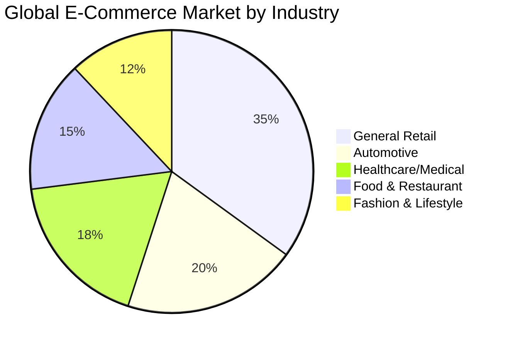
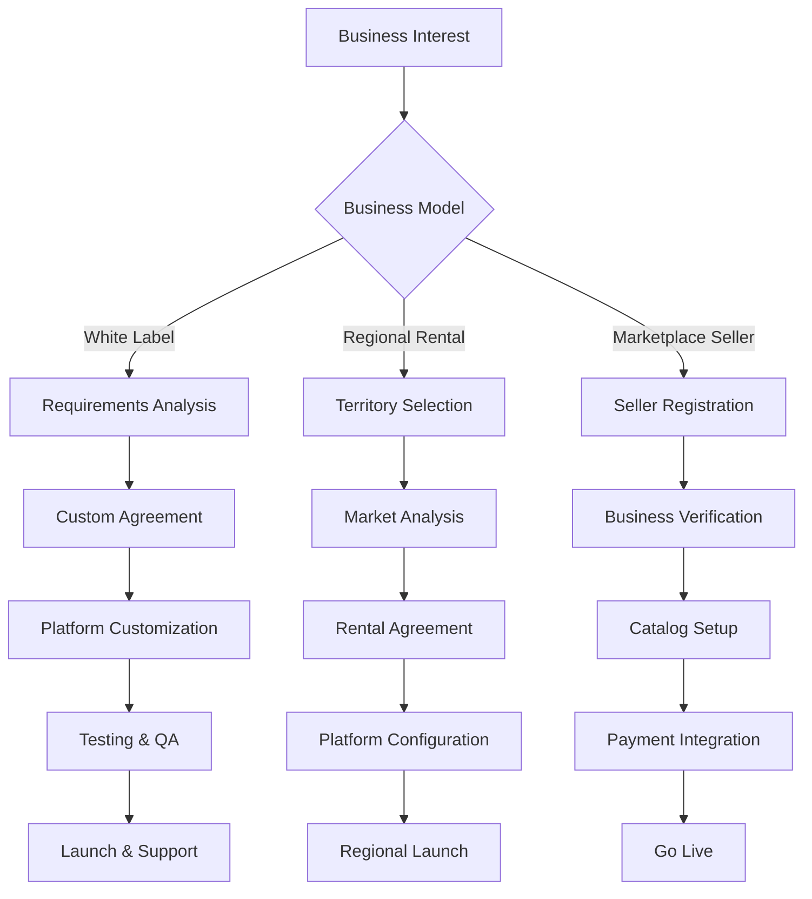
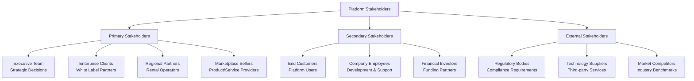
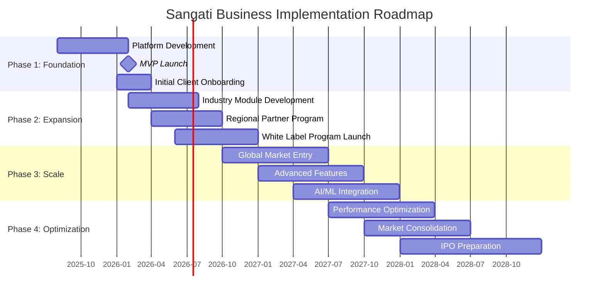

# Sangati Universal E-Commerce Platform
## Business Requirements Document (BRD)

### Document Information
- **Project Name**: Sangati Universal E-Commerce Platform
- **Document Type**: Business Requirements Document (BRD)
- **Version**: 1.0
- **Date**: August 2025
- **Prepared By**: Business Analysis Team
- **Status**: Final

---

## 1. Executive Summary

### 1.1 Business Vision
**Sangati** represents a transformative approach to digital commerce, combining the proven business models of Avyren Technologies with cutting-edge hybrid architecture to create a billion-user scalable, multi-industry e-commerce ecosystem. Our mission is "Connected Innovation, Growing Together" - enabling businesses across diverse industries to thrive through unified digital commerce solutions.

### 1.2 Business Objectives
- **Market Leadership**: Establish dominance in multi-industry e-commerce with 15% market share in key verticals
- **Revenue Diversification**: Generate ₹415B ARR by Year 3 through multiple revenue streams
- **Global Expansion**: Serve 1+ billion users across 50+ countries with localized solutions
- **Industry Innovation**: Pioneer modular, plug-in architecture for industry-specific e-commerce needs
- **Sustainable Growth**: Build scalable business models supporting white-label, rental, and marketplace operations

### 1.3 Strategic Value Proposition
**For Businesses**: Complete e-commerce solution with industry-specific features, flexible deployment models, and global scalability
**For Customers**: Unified shopping experience across industries with trusted, high-performance platform
**For Partners**: Profitable collaboration opportunities through white-label licensing and regional rental models

---

## 2. Business Context and Background

### 2.1 Market Opportunity

**Market Size Analysis**:
- **Total Addressable Market (TAM)**: ₹514.6T global e-commerce market
- **Serviceable Addressable Market (SAM)**: ₹174.3T multi-industry B2B/B2C commerce
- **Serviceable Obtainable Market (SOM)**: ₹26.1T target market share over 5 years

**Industry-Specific Opportunities**:
- **Automotive**: ₹70.55T market with fragmented digital solutions
- **Medical/Healthcare**: ₹373.5T market requiring specialized compliance features
- **Restaurant/Food**: ₹174.3T market needing integrated POS and supply chain solutions
- **Fashion/Retail**: ₹149.4T market demanding multi-channel commerce capabilities

### 2.2 Competitive Landscape

**Direct Competitors**:
- **Shopify**: Limited industry specialization, strong in general retail
- **BigCommerce**: Good enterprise features, lacking industry-specific modules
- **WooCommerce**: Open source flexibility, requires significant customization
- **Magento**: Enterprise-focused, complex implementation and maintenance

**Competitive Advantages**:
- **Industry-Specific Modules**: Pre-built compliance and workflow solutions
- **Multi-Platform Native Apps**: Superior performance vs. web-only solutions
- **Flexible Business Models**: White-label, rental, and marketplace options
- **Billion-User Architecture**: Proven scalability beyond competitor capabilities
- **Modular Design**: Easy customization without breaking core functionality

### 2.3 Business Problem Statement

**Current Market Gaps**:
1. **Fragmented Solutions**: Businesses need multiple platforms for different needs
2. **Limited Industry Focus**: Generic e-commerce platforms lack vertical-specific features
3. **Scalability Constraints**: Existing solutions struggle with enterprise-level growth
4. **Complex Customization**: Significant development overhead for industry requirements
5. **Poor Multi-Platform Experience**: Inconsistent experience across web, mobile, desktop

**Business Impact**:
- Increased operational costs due to multiple vendor management
- Delayed time-to-market for industry-specific features
- Limited scalability constraining business growth
- Poor customer experience leading to reduced conversion rates
- Compliance risks in regulated industries

---

## 3. Business Requirements

### 3.1 Functional Business Requirements

#### 3.1.1 Multi-Model Business Operations

**BR-001: White Label Solutions**
- **Requirement**: Enable complete platform rebranding for enterprise clients
- **Business Justification**: Address enterprise need for branded solutions without development costs
- **Success Criteria**: Deploy fully branded platforms within 2-4 weeks
- **Priority**: High

**BR-002: Regional Rental Model**
- **Requirement**: Provide exclusive territory rights with revenue sharing
- **Business Justification**: Enable passive income for investors while expanding market reach
- **Success Criteria**: Establish profitable regional partnerships with 30%+ margin
- **Priority**: High

**BR-003: Global Marketplace Operations**
- **Requirement**: Support worldwide selling with multi-currency, multi-language capabilities
- **Business Justification**: Capture global market opportunities and increase platform value
- **Success Criteria**: Process transactions in 50+ currencies across 25+ languages
- **Priority**: Medium

#### 3.1.2 Industry-Specific Business Capabilities

**BR-004: Automotive Industry Module**
- **Requirement**: VIN-based part compatibility, warranty tracking, technical specifications
- **Business Justification**: ₹70.55T automotive market requires specialized part fitment solutions
- **Success Criteria**: 95% part compatibility accuracy, integrated warranty management
- **Priority**: High

**BR-005: Medical Industry Module**
- **Requirement**: CDSCO compliance, prescription management, DPDP Act compliant data handling
- **Business Justification**: ₹373.5T healthcare market demands regulatory compliance features
- **Success Criteria**: Full CDSCO/DPDP Act compliance certification, integrated prescription workflows
- **Priority**: High

**BR-006: Restaurant Industry Module**
- **Requirement**: POS integration, FSSAI compliance tracking, supplier management
- **Business Justification**: ₹174.3T food service market needs integrated supply chain solutions
- **Success Criteria**: Integration with major POS systems, FSSAI compliance tracking
- **Priority**: Medium

#### 3.1.3 Revenue Generation Requirements

**BR-007: Transaction Fee Processing**
- **Requirement**: Automated commission collection on all platform transactions
- **Business Justification**: Primary revenue stream ensuring sustainable business model
- **Success Criteria**: 99.9% transaction fee collection accuracy, real-time processing
- **Priority**: Critical

**BR-008: Subscription Management**
- **Requirement**: Tiered subscription plans with feature access control
- **Business Justification**: Recurring revenue provides business stability and predictability
- **Success Criteria**: Automated billing, usage tracking, plan upgrade/downgrade workflows
- **Priority**: High

**BR-009: White Label Licensing**
- **Requirement**: One-time and ongoing licensing fee collection for white-label deployments
- **Business Justification**: High-value enterprise revenue with minimal ongoing costs
- **Success Criteria**: Automated license tracking, usage monitoring, renewal management
- **Priority**: High

### 3.2 Business Process Requirements

#### 3.2.1 Customer Onboarding Processes

**BR-010: White Label Client Onboarding**
- **Process**: Requirements analysis → Agreement → Customization → Testing → Launch
- **Timeline**: 2-4 weeks from agreement to launch
- **Resources**: Dedicated customer success team, technical implementation team
- **Success Metrics**: 95% client satisfaction, <5% implementation delays

**BR-011: Regional Rental Partner Onboarding**
- **Process**: Territory analysis → Market assessment → Agreement → Configuration → Launch
- **Timeline**: 3-6 weeks from initial contact to regional launch
- **Resources**: Business development team, regional support specialists
- **Success Metrics**: 80% partner profitability within 6 months

**BR-012: Marketplace Seller Onboarding**
- **Process**: Registration → Verification → Setup → Integration → Activation
- **Timeline**: 24-48 hours for standard sellers, 1-2 weeks for enterprise
- **Resources**: Automated onboarding system, customer support team
- **Success Metrics**: 90% automated onboarding success rate

#### 3.2.2 Order Management Processes

**BR-013: Multi-Industry Order Processing**
- **Requirement**: Handle complex order workflows specific to each industry vertical
- **Business Justification**: Different industries have unique fulfillment requirements
- **Process Flow**: Order placement → Industry validation → Payment → Fulfillment → Delivery
- **Success Criteria**: 99.5% order accuracy, industry-specific compliance validation

**BR-014: Service Appointment Management**
- **Requirement**: Manage appointment-based services across multiple industries
- **Business Justification**: Service-based businesses require different workflows than product sales
- **Process Flow**: Service selection → Provider matching → Appointment booking → Service delivery → Payment
- **Success Criteria**: 95% appointment completion rate, automated scheduling conflicts resolution

### 3.3 Performance and Scalability Requirements

#### 3.3.1 Business Performance Metrics

**BR-015: Revenue Performance Targets**
- **Year 1**: ₹830M ARR with 50% month-over-month growth
- **Year 2**: ₹41.5B ARR with 15% market penetration in automotive vertical
- **Year 3**: ₹415B ARR with 1B+ user base globally
- **Key Metrics**: GMV growth, take rate optimization, customer lifetime value

**BR-016: Operational Efficiency Targets**
- **Customer Acquisition Cost (CAC)**: <₹4,150 for marketplace sellers, <₹415,000 for enterprise clients
- **Customer Lifetime Value (CLV)**: >₹41,500 for sellers, >₹8.3M for enterprise clients
- **Platform Utilization**: 80%+ of features actively used by 60%+ of users
- **Support Efficiency**: <2 hour response time, 90% first-contact resolution

#### 3.3.2 Scalability Requirements

**BR-017: User Growth Scalability**
- **Concurrent Users**: Support for 10M+ simultaneous active users
- **Geographic Expansion**: Ability to launch in new regions within 30 days
- **Industry Expansion**: New vertical modules deployable within 60 days
- **Infrastructure Scaling**: Automatic scaling to handle 10x traffic spikes

**BR-018: Business Model Scalability**
- **White Label Deployments**: Support for 1,000+ simultaneous branded instances
- **Regional Operations**: Manage 500+ regional rental partnerships
- **Seller Management**: Support for 1M+ active sellers with automated onboarding
- **Transaction Volume**: Process 1M+ transactions per day with 99.99% reliability

---

## 4. Stakeholder Analysis

### 4.1 Primary Stakeholders

**Executive Team**:
- **Interests**: Revenue growth, market expansion, strategic positioning
- **Influence**: High - Final decision authority on major initiatives
- **Requirements**: Regular performance reports, ROI analysis, competitive intelligence

**Enterprise Clients (White Label)**:
- **Interests**: Branded solutions, customization capabilities, reliable performance
- **Influence**: High - Major revenue contributors with specific feature demands
- **Requirements**: Dedicated support, SLA guarantees, customization flexibility

**Regional Partners**:
- **Interests**: Territory exclusivity, profitable operations, marketing support
- **Influence**: Medium - Important for geographic expansion but replaceable
- **Requirements**: Training programs, local market insights, revenue sharing transparency

**Marketplace Sellers**:
- **Interests**: Easy onboarding, sales tools, customer reach, reasonable fees
- **Influence**: Medium - Large collective influence, individual impact varies
- **Requirements**: User-friendly interfaces, analytics tools, payment reliability

### 4.2 Success Criteria by Stakeholder

**Executive Team Success Metrics**:
- **Financial**: Achieve $5B ARR by Year 3, maintain 25%+ profit margins
- **Strategic**: Capture 15% market share in target verticals
- **Operational**: Maintain 99.99% platform uptime, <2s response times

**Enterprise Client Success Metrics**:
- **Performance**: 99.9% uptime for their branded platforms
- **Customization**: Deploy custom features within 4-6 weeks
- **Support**: <1 hour response time for critical issues

**Regional Partner Success Metrics**:
- **Profitability**: 70%+ of partners profitable within 12 months
- **Growth**: 30%+ annual revenue growth for established partners
- **Market Share**: 10%+ local market share within 24 months

**Seller Success Metrics**:
- **Onboarding**: 90%+ successful automated onboarding
- **Sales**: 25%+ increase in sales within 6 months of joining
- **Satisfaction**: 85%+ Net Promoter Score (NPS)

---

## 5. Business Rules and Constraints

### 5.1 Business Rules

**BR-019: Commission Structure Rules**
- **Standard Transaction Fee**: 2.9% + ₹25 per transaction
- **Volume Discounts**: Tiered pricing for high-volume sellers (>₹83M/month)
- **Industry Variations**: Medical transactions 3.5% due to compliance overhead
- **Geographic Adjustments**: Local tax and regulation compliance included

**BR-020: White Label Licensing Rules**
- **Minimum Contract**: 12-month commitment with auto-renewal
- **Customization Limits**: Core platform integrity must be maintained
- **Brand Guidelines**: Client branding must meet quality standards
- **Exclusive Rights**: No competing clients in same industry vertical

**BR-021: Regional Rental Rules**
- **Territory Exclusivity**: Single partner per defined geographic region
- **Performance Requirements**: Minimum revenue thresholds for exclusivity
- **Revenue Sharing**: 70% partner, 30% platform after infrastructure costs
- **Contract Terms**: 3-year initial terms with performance-based renewals

**BR-022: Data Ownership and Privacy Rules**
- **Client Data**: White label clients maintain full ownership of their customer data
- **Regional Data**: Must comply with Indian data residency requirements (DPDP Act)
- **Marketplace Data**: Platform maintains analytics rights while protecting individual privacy
- **Industry Compliance**: Stricter rules for medical, financial, and government sectors

### 5.2 Business Constraints

**BR-023: Regulatory Constraints**
- **Medical Industry**: Full CDSCO compliance required for Indian operations
- **Financial Services**: RBI guidelines and PCI DSS Level 1 compliance for payment processing
- **Data Protection**: DPDP Act compliance for Indian markets
- **Industry Certifications**: Industry-specific certifications (CDSCO, FSSAI, AIS, etc.)

**BR-024: Technical Constraints**
- **Legacy System Integration**: Must support integration with existing client systems
- **Platform Limitations**: Some customizations may require core platform updates
- **Scalability Boundaries**: Infrastructure scaling may require planned downtime
- **Third-Party Dependencies**: Limited by capabilities of integrated services

**BR-025: Financial Constraints**
- **Development Investment**: $50M initial investment over 18 months
- **Operating Costs**: Platform costs must remain <30% of gross revenue
- **Client Payment Terms**: Net 30 terms for enterprise clients may impact cash flow
- **Currency Risk**: Multi-currency operations create foreign exchange exposure

**BR-026: Market Constraints**
- **Competitive Response**: Established players may respond aggressively to market entry
- **Adoption Rates**: Industry adoption may be slower than projected
- **Economic Conditions**: Economic downturns may impact client spending
- **Technology Evolution**: Rapid tech changes may require platform updates

---

## 6. Implementation Strategy

### 6.1 Business Implementation Phases

**Phase 1: Foundation (Months 1-6)**
- **Objective**: Establish core platform functionality and initial market presence
- **Key Activities**: Platform development, MVP launch, first 100 clients onboarded
- **Success Metrics**: ₹83M ARR, 95% platform uptime, 10,000 end users
- **Investment**: ₹1.245B in development and infrastructure

**Phase 2: Expansion (Months 7-12)**
- **Objective**: Scale operations and launch multiple business models
- **Key Activities**: Industry modules, regional partnerships, white-label program
- **Success Metrics**: ₹415M ARR, 500 active sellers, 50,000 end users
- **Investment**: ₹1.66B in marketing, partnerships, and feature development

**Phase 3: Scale (Months 13-18)**
- **Objective**: Achieve significant market presence and geographic expansion
- **Key Activities**: Global expansion, advanced features, AI integration
- **Success Metrics**: ₹2.075B ARR, 10,000 sellers, 500K end users
- **Investment**: ₹830M in global expansion and technology advancement

**Phase 4: Optimization (Months 19-24)**
- **Objective**: Optimize operations for profitability and market leadership
- **Key Activities**: Performance optimization, market consolidation, IPO preparation
- **Success Metrics**: ₹8.3B ARR, 50,000 sellers, 5M end users, 20% profit margin
- **Investment**: ₹415M in optimization and strategic initiatives

### 6.2 Resource Requirements

**Human Resources**:
- **Executive Team**: CEO, CTO, CPO, CMO, CFO (5 people)
- **Engineering**: 50 developers, 10 DevOps, 15 QA engineers
- **Business Development**: 20 sales, 15 customer success, 10 partnerships
- **Operations**: 25 customer support, 10 business analysts, 5 compliance
- **Marketing**: 15 digital marketing, 5 content, 5 design

**Financial Resources**:
- **Total Investment**: ₹4.15B over 24 months
- **Technology Infrastructure**: ₹1.245B (cloud, licenses, tools)
- **Personnel Costs**: ₹2.075B (salaries, benefits, equity)
- **Marketing & Sales**: ₹664M (customer acquisition, partnerships)
- **Operations**: ₹166M (legal, compliance, facilities)

**Technology Resources**:
- **Cloud Infrastructure**: Azure multi-region deployment (India Central, India South)
- **Development Tools**: GitHub Enterprise, Azure DevOps, monitoring tools
- **Third-Party Services**: Indian payment gateways, communication services, analytics
- **Compliance Tools**: Security scanning, audit tools, Indian certification services

### 6.3 Risk Mitigation Strategies

**Market Risks**:
- **Competition**: Focus on unique value proposition, rapid feature development
- **Economic Downturn**: Diversified client base, flexible pricing models
- **Adoption Rates**: Intensive customer education, pilot programs

**Technical Risks**:
- **Scalability Issues**: Comprehensive load testing, gradual scaling approach
- **Security Breaches**: Multi-layered security, regular audits, insurance
- **Integration Failures**: Thorough testing, fallback systems, vendor diversity

**Business Risks**:
- **Client Churn**: Strong customer success programs, performance guarantees
- **Cash Flow**: Conservative financial planning, diverse revenue streams
- **Regulatory Changes**: Proactive compliance monitoring, legal expertise

---

## 7. Success Measurement and KPIs

### 7.1 Financial KPIs

**Revenue Metrics**:
- **Annual Recurring Revenue (ARR)**: ₹830M (Year 1) → ₹41.5B (Year 2) → ₹415B (Year 3)
- **Monthly Recurring Revenue (MRR)**: 50% month-over-month growth target
- **Gross Merchandise Volume (GMV)**: Track total transaction volume across platform
- **Take Rate**: Maintain 2.9% average while optimizing for different verticals

**Profitability Metrics**:
- **Gross Margin**: Target 80%+ gross margins on software services
- **Operating Margin**: Achieve 25%+ operating margins by Year 3
- **Customer Acquisition Cost (CAC)**: <₹4,150 marketplace, <₹415,000 enterprise
- **Customer Lifetime Value (CLV)**: >10x CAC ratio across all customer segments

### 7.2 Operational KPIs

**Platform Performance**:
- **System Uptime**: 99.99% availability (52 minutes downtime/year)
- **Response Time**: <100ms API response time (95th percentile)
- **Transaction Success Rate**: 99.9% successful payment processing
- **User Satisfaction**: Net Promoter Score (NPS) >50

**Business Growth**:
- **User Growth**: 1M (Year 1) → 100M (Year 2) → 1B (Year 3)
- **Seller Growth**: 1,000 (Year 1) → 50,000 (Year 2) → 1M (Year 3)
- **Geographic Expansion**: 5 (Year 1) → 25 (Year 2) → 50 countries (Year 3)
- **Industry Penetration**: 15% market share in target verticals

### 7.3 Strategic KPIs

**Market Position**:
- **Brand Recognition**: Top 3 brand awareness in target industries
- **Competitive Advantage**: Maintain technology and feature leadership
- **Partnership Network**: 500+ regional partners, 50+ strategic integrations
- **Compliance Certifications**: All required industry certifications maintained

**Innovation Metrics**:
- **Feature Velocity**: New features deployed weekly
- **R&D Investment**: 15% of revenue invested in platform advancement
- **Patent Portfolio**: File 10+ patents annually for core innovations
- **Technology Leadership**: Recognition as industry innovation leader

---

## 8. Approval and Sign-off

### 8.1 Document Approval Process

**Review Cycle**:
1. **Initial Review**: Business Analysis Team validation
2. **Stakeholder Review**: Key stakeholder feedback incorporation
3. **Executive Review**: C-level approval and strategic alignment
4. **Final Approval**: Board of Directors sign-off

**Approval Criteria**:
- **Strategic Alignment**: Confirms with overall business strategy
- **Financial Viability**: ROI projections meet investment criteria
- **Technical Feasibility**: Implementation approach is realistic
- **Market Opportunity**: Addressable market size justifies investment
- **Risk Assessment**: Risk mitigation strategies are adequate

### 8.2 Change Management Process

**Document Updates**:
- **Minor Changes**: Business Analysis Team approval required
- **Major Changes**: Full stakeholder review cycle required
- **Strategic Changes**: Executive and board approval required
- **Version Control**: All changes tracked with rationale documentation

**Communication Plan**:
- **Internal**: All team members notified of approved changes
- **External**: Client and partner communications for relevant changes
- **Documentation**: Updated training materials and process documents
- **Timeline**: Implementation timeline updates with change impact assessment

---

## 9. Conclusion

The Sangati Universal E-Commerce Platform Business Requirements Document establishes a comprehensive foundation for building the world's most scalable, industry-agnostic commerce platform. By combining proven business models from Avyren Technologies with innovative hybrid architecture, the platform is positioned to capture significant market share while generating sustainable revenue through multiple streams.

### 9.1 Key Business Outcomes

**Revenue Generation**:
- Multiple revenue streams providing stability and growth potential
- Scalable business models supporting different market segments
- Clear path to ₹415B ARR within 3 years through organic growth

**Market Position**:
- First-mover advantage in industry-specific e-commerce platforms
- Competitive differentiation through technical excellence and business model flexibility
- Strong barriers to entry through network effects and switching costs

**Strategic Value**:
- Platform ecosystem approach creating vendor lock-in and recurring revenue
- Scalable technology foundation supporting unlimited growth
- Modular architecture enabling rapid expansion into new industries

### 9.2 Next Steps

1. **Executive Approval**: Secure final executive and board approval for project initiation
2. **Team Assembly**: Recruit key personnel for development and business operations
3. **Technical Planning**: Finalize technical architecture and development roadmap
4. **Partnership Development**: Begin negotiations with initial white-label and regional partners
5. **Financial Planning**: Secure funding and establish financial controls and reporting

The success of this initiative depends on careful execution of the business strategy, strong team performance, and continuous adaptation to market feedback and competitive pressures.

---

*Document Version: 1.0*  
*Last Updated: August 2025*  
*Approved By: Business Requirements Team*  
*Next Review: October 2025*
