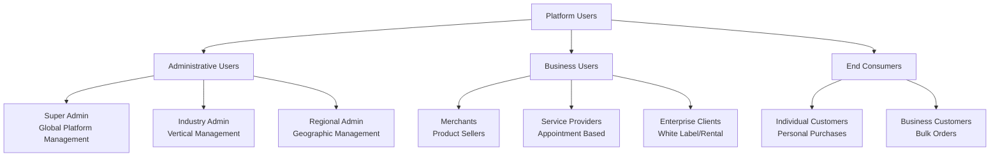
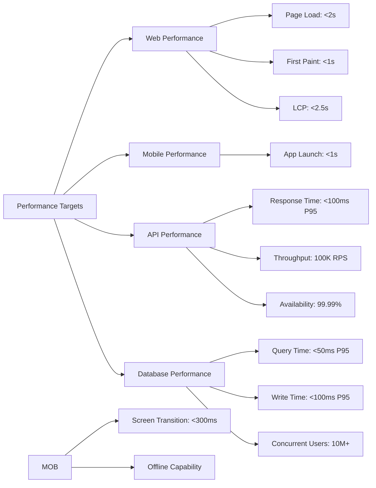

# Sangati Universal E-Commerce Platform
## Product Requirements Document (PRD)

### Document Information
- **Project Name**: Sangati Universal E-Commerce Platform
- **Document Type**: Product Requirements Document (PRD)
- **Version**: 1.0
- **Date**: August 2025
- **Prepared By**: Product Management Team
- **Status**: Final

---

## 1. Executive Summary

### 1.1 Product Vision
**Sangati** is a revolutionary billion-user scalable, multi-platform e-commerce ecosystem that serves diverse industries through a unified technology platform. Our vision is "Connected Innovation, Growing Together" - creating the world's most comprehensive, scalable, and industry-agnostic e-commerce platform.

### 1.2 Product Goals
- **Scale**: Support 1+ billion users globally across multiple industries
- **Multi-Platform**: Native applications for Web, Mobile (iOS/Android), and Desktop (Windows/macOS/Linux)
- **Industry Agnostic**: Modular architecture supporting automotive, medical, restaurant, fashion, and retail
- **Business Models**: White-label, regional rental, and global marketplace options
- **Performance**: Sub-100ms API responses with 99.99% uptime globally

### 1.3 Success Metrics
- **User Growth**: 1M (Year 1) → 100M (Year 2) → 1B (Year 3)
- **Revenue**: ₹830M ARR (Year 1) → ₹41.5B ARR (Year 2) → ₹415B ARR (Year 3)
- **Performance**: <2s page load, 99.99% uptime, <100ms API response
- **Market Share**: 15% in target verticals within 3 years

---

## 2. Product Overview

### 2.1 Target Users



### 2.2 User Personas

**Super Admin**
- **Role**: Platform-wide management and configuration
- **Responsibilities**: System monitoring, industry module management, global settings
- **Goals**: Ensure platform stability, manage growth, optimize performance
- **Pain Points**: Complexity of multi-industry management, scaling challenges

**Industry Admin**
- **Role**: Vertical-specific feature management
- **Responsibilities**: Compliance configuration, industry user management, specialized analytics
- **Goals**: Optimize industry-specific features, ensure regulatory compliance
- **Pain Points**: Industry-specific compliance complexity, feature coordination

**Merchant**
- **Role**: Product/service seller on the platform
- **Responsibilities**: Catalog management, order fulfillment, customer service
- **Goals**: Increase sales, manage inventory efficiently, reach new customers
- **Pain Points**: Platform complexity, competition, inventory management

**End Customer**
- **Role**: Buyer of products/services
- **Responsibilities**: Browse, purchase, provide feedback
- **Goals**: Find quality products/services, good prices, reliable delivery
- **Pain Points**: Information overload, trust issues, delivery reliability

### 2.3 Use Cases

**Primary Use Cases**:
1. **Multi-Industry E-Commerce**: Sell products across automotive, medical, restaurant, fashion verticals
2. **Service Marketplace**: Book appointments with service providers (doctors, mechanics, stylists)
3. **White-Label Deployment**: Enterprise clients deploy branded versions
4. **Regional Operations**: Territory-specific platform rental and management
5. **Global Marketplace**: International selling with multi-currency, multi-language support

---

## 3. Functional Requirements

### 3.1 Core E-Commerce Features

#### 3.1.1 User Management System
**Epic**: User Registration and Authentication

**User Stories**:
- As a new user, I want to register using email/phone so I can access the platform
- As a user, I want to login using social media accounts for convenience
- As an admin, I want to manage user roles and permissions for security
- As a user, I want to recover my password securely when forgotten

**Acceptance Criteria**:
- Support email, phone, and social media registration
- Implement OAuth 2.0 for social login (Google, Facebook, Apple)
- Multi-factor authentication for enhanced security
- Role-based access control with granular permissions
- Password recovery with secure token-based system

#### 3.1.2 Product Catalog Management
**Epic**: Comprehensive Product Management

**User Stories**:
- As a merchant, I want to upload products with industry-specific attributes
- As a customer, I want to search products across multiple categories efficiently
- As an admin, I want to manage product categories and attributes by industry
- As a merchant, I want to bulk upload/edit products for efficiency

**Acceptance Criteria**:
- Support for unlimited product variants and configurations
- Industry-specific attribute templates (automotive parts, medical supplies, etc.)
- Advanced search with filters, sorting, and faceted navigation
- Bulk product management tools with CSV import/export
- Digital asset management for images, videos, documents

#### 3.1.3 Shopping Cart and Checkout
**Epic**: Seamless Purchase Experience

**User Stories**:
- As a customer, I want to add products to cart from multiple sellers
- As a customer, I want to save items for later purchase
- As a customer, I want multiple payment options for convenience
- As a customer, I want to track my order status in real-time

**Acceptance Criteria**:
- Multi-seller cart with combined or separate checkout options
- Guest checkout and registered user workflows
- Integration with multiple payment gateways (Stripe, PayPal, etc.)
- Real-time inventory checking and reservation
- Order tracking with notifications and updates

### 3.2 Service Provider Features

#### 3.2.1 Appointment Booking System
**Epic**: Service Appointment Management

**User Stories**:
- As a service provider, I want to set my available time slots
- As a customer, I want to book appointments with preferred providers
- As a provider, I want to manage my calendar and appointments
- As a customer, I want to receive appointment reminders

**Acceptance Criteria**:
- Calendar integration with time slot management
- Appointment booking with confirmation workflows
- Automated reminders via email, SMS, and push notifications
- Rescheduling and cancellation policies management
- Service provider profile with ratings and reviews

### 3.3 Industry-Specific Modules

#### 3.3.1 Automotive Module
**Epic**: Automotive Parts and Services

**User Stories**:
- As a customer, I want to find parts compatible with my vehicle VIN
- As a parts seller, I want to specify fitment information
- As a service provider, I want to schedule automotive services
- As a customer, I want to track warranty information

**Acceptance Criteria**:
- VIN-based part compatibility checking
- Fitment guides and technical specifications
- Warranty tracking and claims processing
- Integration with automotive databases (Mitchell, AllData)

#### 3.3.2 Medical Module
**Epic**: Healthcare Products and Services

**User Stories**:
- As a pharmacy, I want to manage prescription medications
- As a patient, I want to verify doctor credentials
- As a medical supplier, I want to ensure regulatory compliance
- As a healthcare provider, I want to manage patient appointments

**Acceptance Criteria**:
- CDSCO compliance tracking and verification
- Prescription management with verification workflows
- DPDP Act compliant data handling and storage
- Medical device certification tracking
- Drug interaction warnings and alerts

### 3.4 Administrative Features

#### 3.4.1 Multi-Tenant Management
**Epic**: Platform Administration

**User Stories**:
- As a super admin, I want to configure platform-wide settings
- As an industry admin, I want to manage vertical-specific features
- As a regional admin, I want to control geographic operations
- As an admin, I want to monitor platform performance and usage

**Acceptance Criteria**:
- Hierarchical role-based access control
- Multi-tenant data isolation and security
- Configurable industry modules and features
- Real-time monitoring and alerting dashboards

---

## 4. Non-Functional Requirements

### 4.1 Performance Requirements



**Specific Requirements**:
- **Web Performance**: <2s page load, <2.5s LCP, >90 Lighthouse score
- **Mobile Performance**: <1s app launch, <300ms screen transitions
- **API Performance**: <100ms response time (95th percentile), 100K+ RPS capacity
- **Database Performance**: <50ms query time, support for 10M+ concurrent users
- **Network**: Global CDN with <50ms latency worldwide

### 4.2 Scalability Requirements

**Horizontal Scaling**:
- Auto-scaling Kubernetes clusters across multiple regions
- Database sharding and read replicas for high availability
- Event-driven architecture with Apache Kafka
- Microservices deployment with independent scaling

**Vertical Scaling**:
- Support for resource-intensive operations (bulk imports, analytics)
- Elastic infrastructure scaling based on demand
- Multi-tier caching strategy (application, database, CDN)

### 4.3 Security Requirements

**Authentication & Authorization**:
- OAuth 2.0/OpenID Connect implementation
- Multi-factor authentication support
- JWT token-based stateless authentication
- Role-based access control with fine-grained permissions

**Data Protection**:
- End-to-end encryption (AES-256 at rest, TLS 1.3 in transit)
- PCI DSS compliance for payment processing
- DPDP Act compliance for data privacy
- CDSCO compliance for medical data

**Infrastructure Security**:
- Zero-trust network architecture
- Web Application Firewall (WAF) protection
- DDoS mitigation and rate limiting
- Regular security audits and penetration testing

### 4.4 Availability & Reliability

**Uptime Requirements**:
- 99.99% availability (52 minutes downtime per year)
- Multi-region deployment with failover capabilities
- Blue-green deployment for zero-downtime updates
- Disaster recovery with RTO < 1 hour, RPO < 15 minutes

**Monitoring & Alerting**:
- Real-time system monitoring and alerting
- Distributed tracing across all services
- Business metrics monitoring and reporting
- Automated incident response workflows

---

## 5. Technical Architecture

### 5.1 System Architecture Overview

```mermaid
architecture-beta
    group api(cloud)[API Layer]
    service gateway(internet)[API Gateway] in api
    service express(server)[Express API] in api
    service kafka(queue)[Event Bus] in api

    group clients(cloud)[Client Applications]
    service web(browser)[NextJS Web] in clients
    service mobile(mobile)[React Native] in clients
    service desktop(desktop)[Electron] in clients

    group services(cloud)[Microservices]
    service user(server)[User Service] in services
    service product(server)[Product Service] in services
    service order(server)[Order Service] in services
    service payment(server)[Payment Service] in services

    group data(cloud)[Data Layer]
    service postgres(database)[PostgreSQL] in data
    service cosmos(database)[Cosmos DB] in data
    service redis(database)[Redis] in data
    service blob(disk)[Blob Storage] in data

    group infra(cloud)[Infrastructure]
    service aks(server)[Azure Kubernetes] in infra
    service cdn(internet)[Cloudflare CDN] in infra
    service monitor(server)[Monitoring] in infra

    web:R --> L:cdn
    mobile:R --> L:cdn
    desktop:R --> L:cdn
    cdn:R --> L:gateway
    gateway:R --> L:express
    express:B --> T:user
    express:B --> T:product
    express:B --> T:order
    express:B --> T:payment
    user:B --> T:postgres
    product:B --> T:cosmos
    order:B --> T:postgres
    payment:B --> T:postgres
    express:R --> L:redis
    express:R --> L:blob
    order:R --> L:kafka
    aks:T --> B:express
    aks:T --> B:services
    monitor:T --> B:aks
```

### 5.2 Technology Stack

**Frontend Technologies**:
- **Web**: NextJS 14, React 18, TypeScript, Tailwind CSS, Shadcn/UI
- **Mobile**: React Native 0.74, Expo SDK 51, Expo Router, NativeWind
- **Desktop**: Electron 30, React, TypeScript
- **State Management**: Zustand, TanStack Query
- **Storage**: MMKV (mobile), IndexedDB (web), SQLite (desktop)

**Backend Technologies**:
- **Runtime**: Node.js 20, TypeScript 5
- **Framework**: Express 5, Fastify (high-performance endpoints)
- **Database**: PostgreSQL 15, Azure Cosmos DB, Redis 7
- **ORM**: Prisma with custom extensions
- **Validation**: Zod schemas shared across frontend/backend
- **Event Streaming**: Apache Kafka

**Infrastructure Technologies**:
- **Container Orchestration**: Kubernetes (Azure AKS - India Central)
- **CI/CD**: GitHub Actions, Turborepo, EAS
- **Monitoring**: OpenTelemetry, Grafana, Azure Monitor
- **CDN**: Cloudflare with edge computing (India edge locations)
- **Security**: Azure Key Vault, WAF, DDoS protection

### 5.3 Data Architecture

**Database Strategy**:
- **PostgreSQL**: Transactional data (users, orders, payments)
- **Cosmos DB**: Product catalogs, user-generated content
- **Redis**: Caching, sessions, real-time data
- **Blob Storage**: Media files, documents, static assets

**Data Flow**:
1. Client requests hit CDN/edge locations
2. API Gateway routes to appropriate microservices
3. Services query databases with caching layers
4. Events published to Kafka for async processing
5. Analytics and ML services consume events for insights

---

## 6. User Experience Requirements

### 6.1 Design System

**Visual Design**:
- Modern, clean, and professional interface
- Consistent design tokens across all platforms
- Dark/light mode support with system preference detection
- Accessibility compliance (WCAG 2.1 AA standards)
- Responsive design for all screen sizes

**Component Library**:
- Shared component library across web, mobile, desktop
- Platform-specific adaptations while maintaining consistency
- Comprehensive Storybook documentation
- Design tokens for colors, typography, spacing, shadows

### 6.2 User Interface Requirements

**Navigation**:
- Intuitive navigation structure across all platforms
- Breadcrumb navigation for deep product categories
- Quick access to frequently used features
- Search-first approach with intelligent suggestions

**Forms and Inputs**:
- Progressive disclosure for complex forms
- Real-time validation with helpful error messages
- Auto-save functionality for long forms
- Accessibility features (keyboard navigation, screen readers)

### 6.3 Performance UX

**Loading States**:
- Skeleton screens for content loading
- Progressive loading for large data sets
- Optimistic updates for user actions
- Offline functionality with sync when connected

**Feedback and Notifications**:
- Real-time notifications for important events
- Toast messages for action confirmations
- Progress indicators for long-running operations
- Error handling with recovery suggestions

---

## 7. Integration Requirements

### 7.1 Third-Party Integrations

**Payment Gateways**:
- Razorpay, PayU, CCAvenue, Instamojo
- Regional payment methods (UPI, Paytm, PhonePe, Google Pay)
- Cryptocurrency payment support
- Buy now, pay later services (LazyPay, Simpl, ZestMoney)

**Shipping and Logistics**:
- FedEx, UPS, DHL, Blue Dart, Delhivery, Ecom Express
- Real-time tracking integration
- Shipping rate calculation APIs
- Return and refund processing

**Communication Services**:
- Email (SendGrid, AWS SES, Mailgun)
- SMS (Twilio, AWS SNS, MSG91, Karix)
- Push notifications (Firebase, Azure Notification Hubs)
- Video calling for customer support (Zoom, Google Meet)

### 7.2 Industry-Specific Integrations

**Automotive**:
- Parts compatibility databases (Mitchell, AllData, Indian automotive databases)
- VIN decoding services
- OEM part catalogs (Maruti, Hyundai, Tata, Mahindra)
- Service booking systems

**Medical**:
- Electronic Health Records (EHR) systems
- Prescription verification services
- CDSCO medical device databases
- Telemedicine platforms

**Restaurant**:
- POS system integrations (Square, Toast, Revel)
- FSSAI food safety databases
- Nutrition information APIs
- Inventory management systems

---

## 8. Development and Deployment

### 8.1 Development Methodology

**Agile Approach**:
- Scrum methodology with 2-week sprints
- Cross-functional teams for each major feature area
- Continuous integration and deployment
- Regular retrospectives and process improvements

**Quality Assurance**:
- Test-driven development (TDD) approach
- Automated testing at unit, integration, and E2E levels
- Code review requirements for all changes
- Performance testing for critical user journeys

### 8.2 Deployment Strategy

**Environments**:
- **Development**: Feature branches with preview deployments (India Central)
- **Staging**: Production-like environment for final testing (India Central)
- **Production**: Multi-region deployment with blue-green strategy (India Central, India South)

**Release Process**:
- Feature flags for gradual rollouts
- A/B testing framework for new features
- Automated rollback capabilities
- Zero-downtime deployments

---

## 9. Success Criteria and Metrics

### 9.1 Key Performance Indicators (KPIs)

**User Metrics**:
- Monthly Active Users (MAU) growth rate
- User retention rates (Day 1, Day 7, Day 30)
- User engagement metrics (session duration, page views)
- Conversion rates across different user funnels

**Business Metrics**:
- Gross Merchandise Volume (GMV) growth
- Revenue per user (ARPU)
- Take rate (commission percentage)
- Customer lifetime value (CLV)

**Technical Metrics**:
- API response times and error rates
- System uptime and availability
- Page load times across different regions
- Mobile app performance scores

### 9.2 Launch Criteria

**MVP Launch Criteria**:
- Core e-commerce functionality operational
- At least 2 industry modules fully integrated
- Performance targets met for initial user base
- Security and compliance requirements satisfied
- User acceptance testing completed successfully

**Full Platform Launch Criteria**:
- All planned industry modules operational
- Multi-region deployment completed
- Billion-user scale infrastructure tested
- Comprehensive monitoring and alerting in place
- Business model validation across different markets

---

## 10. Risks and Mitigation

### 10.1 Technical Risks

**Scalability Challenges**:
- **Risk**: System performance degradation under high load
- **Mitigation**: Early load testing, gradual scaling, performance monitoring
- **Contingency**: Auto-scaling infrastructure, circuit breakers

**Data Consistency**:
- **Risk**: Data inconsistencies in distributed system
- **Mitigation**: Event sourcing, CQRS patterns, eventual consistency
- **Contingency**: Data reconciliation processes, manual correction tools

### 10.2 Business Risks

**Market Competition**:
- **Risk**: Established competitors with network effects
- **Mitigation**: Focus on underserved industries, superior UX
- **Contingency**: Pivot strategy, partnership opportunities

**Regulatory Compliance**:
- **Risk**: Changing regulations across different industries
- **Mitigation**: Modular compliance framework, legal consultation
- **Contingency**: Rapid compliance updates, market exit if necessary

---

## 11. Future Roadmap

### 11.1 Phase 2 Features (Year 2)

**Advanced AI/ML**:
- Personalized product recommendations
- Dynamic pricing optimization
- Fraud detection and prevention
- Automated customer support

**Global Expansion**:
- Multi-language support (20+ languages)
- Multi-currency handling with real-time conversion
- Regional compliance frameworks
- Local payment method integrations

### 11.2 Phase 3 Features (Year 3+)

**Emerging Technologies**:
- Augmented Reality (AR) product visualization
- Voice commerce integration
- Blockchain-based supply chain tracking
- IoT device integration for automated ordering

**Advanced Analytics**:
- Predictive analytics for inventory management
- Customer behavior prediction
- Market trend analysis
- Automated business intelligence

---

## Conclusion

The Sangati Universal E-Commerce Platform PRD outlines a comprehensive solution for building the world's most scalable, industry-agnostic e-commerce ecosystem. By combining cutting-edge technology with flexible business models, the platform is positioned to serve billions of users across diverse industries while maintaining high performance, security, and reliability standards.

The success of this platform depends on careful execution of the technical architecture, rigorous adherence to performance and security requirements, and continuous adaptation to market needs and user feedback.

---

*Document Version: 1.0*  
*Last Updated: August 2025*  
*Next Review: September 2025*  
*Approved By: Product Management Team*
