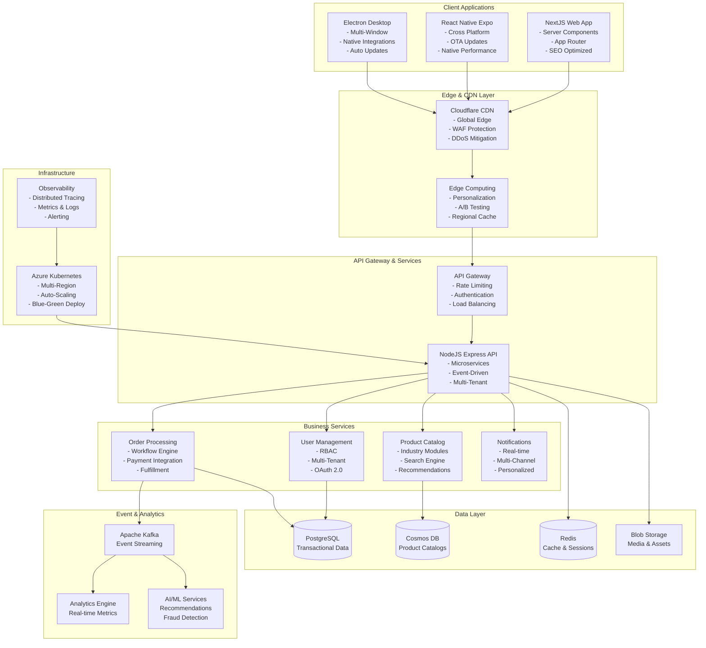
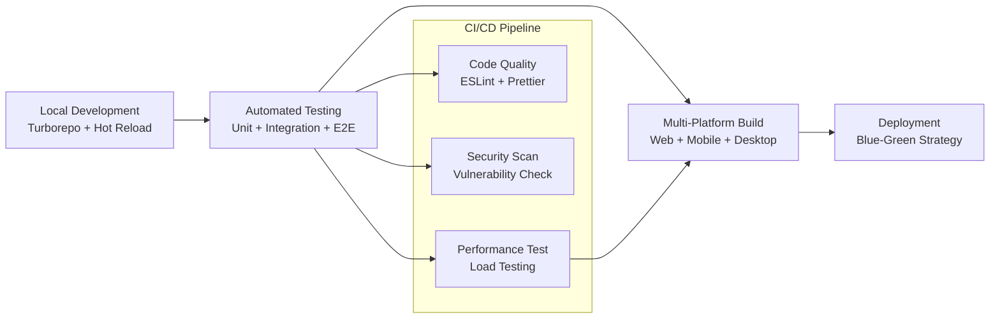

# Avyren Technologies Universal E-Commerce Platform
## Comprehensive Project Overview Document

### Executive Summary

**Avyren-Technologies** is a revolutionary billion-user scalable, multi-platform e-commerce ecosystem designed to serve diverse industries including automotive, medical, restaurant, fashion, and general retail through a unified technology platform. The project combines the business flexibility of Avyren's multi-model approach with cutting-edge hybrid architecture leveraging **NextJS for web**, **React Native Expo for mobile**, **Electron for desktop**, and a unified **NodeJS backend**.

**Project Vision**: "Connected Innovation, Growing Together" - Creating the world's most comprehensive, scalable, and industry-agnostic e-commerce platform that empowers businesses of all sizes to sell effectively across all digital touchpoints.

---

## 1. Business Requirements & Models

### 1.1 Primary Business Models

**Multi-Model Digital Commerce Solution** inspired by Avyren's approach:

#### A. White Label Solution
- **Complete Brand Integration**: Replace all platform branding with client's identity
- **Custom Environment Setup**: Configure platform according to specific business requirements
- **Complete Control**: Manage user base, pricing, and business rules independently
- **Technology Independence**: Full platform technology without our branding
- **Scalable Solution**: Start small and grow with robust infrastructure

**Target Clients**:
- Established businesses wanting their own marketplace
- Entrepreneurs launching branded platforms
- Companies seeking complete customer relationship control
- Organizations with specific industry requirements

#### B. Regional Rental Model
- **Exclusive Geographic Rights**: Rent platform for specific regions/cities
- **Turn-Key Operation**: Complete technical infrastructure provided
- **Revenue Sharing**: Generate income through platform usage
- **Local Market Focus**: Cater specifically to regional market needs
- **Minimal Technical Investment**: Focus on business, not development

**Revenue Structure**:
- Fixed rental fee for exclusive regional rights
- Percentage-based revenue sharing model
- Flexible contract terms based on market size
- Performance-based incentives available

#### C. Global E-Commerce Platform
- **Worldwide Marketplace**: Global product listing capabilities
- **Seller Independence**: Complete control over products, pricing, customer service
- **Integrated Logistics**: Preferred delivery agency integration
- **Multi-Currency Support**: Accept payments in various currencies
- **International Shipping**: Coordinate with global delivery partners

### 1.2 Target Markets & Industries

**Primary Industries**:
- **Automotive**: Parts suppliers, dealerships, service centers (₹70.55T global market)
- **Medical**: Pharmacies, medical equipment suppliers, healthcare providers (₹373.5T global market)
- **Restaurant**: Food suppliers, POS systems, delivery services (₹174.3T global market)
- **General Retail**: Small to enterprise-level merchants across all categories
- **Fashion & Textiles**: Clothing, accessories, and lifestyle products
- **Hardware & Home**: Tools, building supplies, home improvement

**User Hierarchy**:
- **Super Admin**: Platform-wide management and configuration
- **Industry Admin**: Vertical-specific feature management
- **Regional Admin**: Geographic area management
- **Merchant Admin**: Store management and operations
- **End Customers**: B2B and B2C purchasers across industries

### 1.3 Revenue Model

**Multiple Revenue Streams**:
- **Transaction Fees**: 2.9% + ₹25 per transaction
- **Platform Rental Fees**: White-label and regional licensing
- **Subscription Tiers**: ₹2,407/month (Basic), ₹8,217/month (Professional), ₹24,817/month (Enterprise)
- **Industry Modules**: ₹16,517-₹82,917 one-time licensing per vertical
- **Premium Features**: Analytics, AI recommendations, advanced integrations
- **Advertising & Promotion**: Sponsored listings, banner ads, featured placements

**Success Metrics**:
- **User Growth**: 1M users (Year 1), 100M users (Year 2), 1B users (Year 3)
- **Revenue Targets**: ₹830M ARR (Year 1), ₹41.5B ARR (Year 2), ₹415B ARR (Year 3)
- **Market Penetration**: 15% in target verticals within 3 years

---

## 2. Technical Architecture

### 2.1 Hybrid Multi-Platform Architecture



### 2.2 Technology Stack

**Frontend Applications**:
- **Web**: NextJS 14 with App Router, React Server Components, Tailwind CSS, Shadcn/UI
- **Mobile**: React Native with Expo SDK 50, Expo Router, NativeWind, Zustand, MMKV
- **Desktop**: Electron 30 with NextJS renderer, native OS integrations

**Backend Infrastructure**:
- **API Server**: NodeJS 20, Express 5, TypeScript, Prisma ORM, Zod validation
- **Database**: PostgreSQL 15 (primary), Azure Cosmos DB (catalog), Redis 7 (cache)
- **Message Queue**: Apache Kafka for event-driven architecture
- **Cloud Platform**: Azure Kubernetes Service with multi-region deployment

**Shared Libraries & Tools**:
- **State Management**: Zustand for lightweight state, TanStack Query for server state
- **Validation**: Zod schemas shared across frontend and backend
- **Styling**: Tailwind CSS with NativeWind for consistent design system
- **Storage**: MMKV for mobile persistence, optimized performance
- **CI/CD**: GitHub Actions, Turborepo, EAS, Electron Builder

### 2.3 Monorepo Structure

```
Avyren-Technologies-platform/
├── apps/
│   ├── web/                    # NextJS web application
│   ├── mobile/                 # React Native Expo application
│   ├── desktop/                # Electron desktop application
│   └── api/                    # NodeJS Express backend
├── packages/
│   ├── shared/                 # Core business logic and types
│   ├── ui/                     # Cross-platform component library
│   ├── db/                     # Database schemas and migrations
│   └── industry-modules/       # Vertical-specific features
│       ├── automotive/
│       ├── medical/
│       ├── restaurant/
│       └── fashion/
├── libs/
│   ├── api-client/             # HTTP client with TanStack Query hooks
│   ├── auth/                   # Authentication utilities
│   └── validation/             # Shared validation schemas
└── tools/
    ├── configs/                # ESLint, prettier, TypeScript configs
    └── docker/                 # Docker configurations
```

---

## 3. Core Platform Features

### 3.1 E-Commerce Module

**Product Management**:
- Category-based product upload and management
- Industry-specific product attributes and taxonomies
- Dynamic pricing rules and bulk operations
- Multi-variant products with complex configurations
- Digital asset management (images, videos, documents)

**Shopping Experience**:
- Advanced product search and filtering
- Shopping cart functionality with saved items
- Wishlist and comparison features
- Guest checkout and registered user flows
- Multiple payment gateways integration

**Order Management**:
- Complex workflow support (quotes, approvals, procurement)
- Multi-warehouse inventory tracking
- Automated fulfillment and shipping integration
- Return and refund processing
- Order history and tracking

### 3.2 Service Provider Module

**Service Categories**:
- Doctors & Clinics
- Transporters & Logistics
- Hair Stylists & Salons
- Car Garages & Auto Services
- Electricians, Plumbers & Carpenters
- Professional Services
- Others (Expandable)

**Service Management**:
- Service profile management with location, timings, expertise
- Calendar and time-slot configuration
- Appointment booking system with confirmations
- In-app chat and communication tools
- Service history and automated reminders
- Ratings, reviews, and feedback system

### 3.3 Industry-Specific Modules

**Automotive Module**:
- VIN-based part compatibility checking
- AIS standards compliance and fitment guides
- Warranty tracking and claims processing
- Service appointment scheduling
- OEM parts verification

**Medical Module**:
- CDSCO compliance and regulatory tracking
- Prescription management and verification
- Medical device certification requirements
- DPDP Act compliant data handling
- Drug interaction warnings

**Restaurant Module**:
- FSSAI compliance and food safety tracking
- Nutritional information management
- Supplier relationship management
- POS system integrations
- Menu management with seasonal items

### 3.4 Admin Dashboard Functions

**Super Admin Capabilities**:
- Platform-wide configuration and settings
- Industry module activation/deactivation
- Global user management and role assignment
- System performance monitoring
- Revenue and analytics dashboards

**Industry Admin Functions**:
- Vertical-specific feature management
- Compliance configuration per industry
- Industry user approval/suspension
- Specialized analytics and reporting
- Custom workflow configuration

**Merchant Admin Tools**:
- Store setup and branding
- Product/service catalog management
- Order and appointment processing
- Customer communication tools
- Sales analytics and reporting

---

## 4. Scalability & Performance Strategy

### 4.1 Growth Phases

```mermaid
gantt
    title AvyrenTechnologies Platform Scaling Roadmap
    dateFormat X
    axisFormat %s
    
    section Foundation Phase
    Core Platform Development     :milestone, m1, 0, 0
    Single Region Deployment      :active, p1, 0, 6
    Basic Industry Modules        :p1a, 3, 9
    
    section Growth Phase
    Multi-Region Expansion        :p2, 6, 12
    Advanced Caching              :p2a, 9, 15
    Additional Verticals          :p2b, 12, 18
    
    section Scale Phase
    Microservices Architecture    :p3, 18, 24
    Global Edge Computing         :p3a, 21, 27
    AI/ML Integration            :p3b, 24, 30
    
    section Hyperscale Phase
    Multi-Cloud Deployment        :p4, 30, 36
    Advanced Analytics           :p4a, 33, 39
    Billion User Infrastructure   :p4b, 36, 42
```



**Phase 1: Foundation (0-100K users)**
- Single-region deployment in Azure Central India
- Core e-commerce and service features
- Basic monitoring and observability
- One primary industry vertical

**Phase 2: Growth (100K-1M users)**
- Multi-region deployment with Azure Front Door (India Central, India South)
- Database read replicas and Redis clustering
- Additional industry modules and features
- Advanced search and recommendation engine

**Phase 3: Scale (1M-100M users)**
- Full microservices architecture
- Database sharding and partitioning
- Global CDN with edge computing (India edge locations)
- AI-powered personalization and fraud detection

**Phase 4: Hyperscale (100M-1B+ users)**
- Multi-cloud deployment for redundancy
- Event-driven architecture with real-time analytics
- Advanced edge computing for personalization
- Comprehensive compliance and security frameworks

### 4.2 Database Scaling Strategy

**Data Architecture**:
- **PostgreSQL**: Transactional data with horizontal sharding
- **Azure Cosmos DB**: Product catalogs with global distribution
- **Redis**: Multi-tier caching and session management
- **Blob Storage**: Media assets with CDN integration

**Scaling Techniques**:
- **Horizontal Sharding**: User-based and geographical partitioning
- **Read Replicas**: Regional distribution for optimal performance
- **Caching Strategy**: Multi-level caching (application, database, CDN)
- **Event Sourcing**: Audit trails and state reconstruction

---

## 5. Security & Compliance Framework

### 5.1 Authentication & Authorization

**Identity Management**:
- **OAuth 2.0/OpenID Connect**: Social login integration
- **JWT Tokens**: Stateless authentication with refresh rotation
- **Multi-Factor Authentication**: SMS, email, authenticator apps
- **Role-Based Access Control**: Granular permissions per user role

**Security Measures**:
- **Zero-Trust Architecture**: All communications verified and encrypted
- **End-to-End Encryption**: AES-256 at rest, TLS 1.3 in transit
- **API Security**: Rate limiting, request validation, CORS policies
- **Regular Security Audits**: Penetration testing and vulnerability scans

### 5.2 Compliance Framework

**Regulatory Compliance**:
- **DPDP Act**: Indian Digital Personal Data Protection Act compliance
- **IT Act 2000**: Information Technology Act compliance
- **RBI Guidelines**: Reserve Bank of India payment security standards
- **PCI DSS**: Payment card industry security standards
- **Companies Act**: Financial reporting compliance for enterprise clients

**Industry-Specific Requirements**:
- **CDSCO Regulations**: Central Drugs Standard Control Organization compliance
- **FSSAI Standards**: Food Safety and Standards Authority of India regulations
- **AIS Standards**: Automotive Industry Standards for parts certification
- **RBI Guidelines**: Banking and payment processing regulations

---

## 6. Development & Deployment Strategy

### 6.1 Development Workflow



**Development Environment**:
- **Monorepo Management**: Turborepo for efficient builds and caching
- **Code Quality**: ESLint, Prettier, TypeScript strict mode
- **Testing Strategy**: Jest, Playwright, Detox for comprehensive coverage
- **Local Development**: Docker Compose for consistent environments

**Deployment Strategy**:
- **Web**: Automated deployment to Azure App Service (India Central)
- **Mobile**: EAS Build and Submit for app stores (Google Play Store, Apple App Store)
- **Desktop**: Electron Builder with code signing
- **API**: Containerized deployment to Azure Kubernetes Service (India Central)

### 6.2 Monitoring & Observability

**Application Performance**:
- **Real User Monitoring**: Core Web Vitals and mobile metrics
- **Synthetic Monitoring**: Critical user journey testing
- **Error Tracking**: Comprehensive logging and alerting
- **Business Metrics**: Revenue, conversion, engagement tracking

**Infrastructure Monitoring**:
- **System Metrics**: CPU, memory, disk, network utilization
- **Application Metrics**: Response times, throughput, error rates
- **Custom Metrics**: Business-specific KPIs and alerts
- **Distributed Tracing**: End-to-end request tracking

---

## 7. Business Implementation Roadmap

### 7.1 Getting Started Processes

**For White Label Clients**:
1. **Consultation**: Requirements analysis and customization needs assessment
2. **Agreement**: Licensing agreement with detailed specifications
3. **Development**: Platform customization and brand integration (2-4 weeks)
4. **Testing**: Comprehensive QA and user acceptance testing
5. **Launch**: Go-live support with training and documentation
6. **Support**: Ongoing technical support and maintenance

**For Regional Rental Partners**:
1. **Territory Selection**: Geographic region analysis and selection
2. **Market Analysis**: Local competition and opportunity assessment
3. **Contract**: Regional exclusive rights agreement
4. **Setup**: Platform configuration for local market needs
5. **Launch**: Marketing support and business development assistance
6. **Operations**: Ongoing platform management and revenue sharing

**For E-commerce Sellers**:
1. **Registration**: Seller account creation and profile setup
2. **Verification**: Business verification and compliance check
3. **Setup**: Product catalog configuration and pricing
4. **Integration**: Payment methods and delivery partner connection
5. **Launch**: Store activation and customer acquisition
6. **Growth**: Utilization of platform tools for business expansion

### 7.2 Success Metrics & KPIs

**Technical Performance**:
- **Page Load Time**: <2 seconds for web, <1 second for mobile
- **API Response Time**: <100ms for 95th percentile
- **System Uptime**: 99.99% availability with <5 minutes MTTR
- **Error Rate**: <0.1% for all critical user journeys

**Business Growth**:
- **User Acquisition**: 50% month-over-month growth in Year 1
- **Revenue Growth**: ₹830M ARR by end of Year 1
- **Market Penetration**: 5% market share in automotive vertical by Year 2
- **Customer Satisfaction**: NPS score >50, retention >85%

---

## 8. Risk Management & Mitigation

### 8.1 Technical Risks

**Scalability Challenges**:
- **Risk**: Database bottlenecks at high transaction volumes
- **Mitigation**: Early implementation of sharding and read replicas
- **Monitoring**: Proactive performance monitoring and alerting

**Security Vulnerabilities**:
- **Risk**: Data breaches affecting customer trust and compliance
- **Mitigation**: Regular security audits, penetration testing, compliance reviews
- **Response**: Incident response plan with customer communication protocols

### 8.2 Business Risks

**Market Competition**:
- **Risk**: Established players with significant market share
- **Mitigation**: Focus on industry-specific features and superior performance
- **Strategy**: Rapid expansion into underserved verticals

**Regulatory Changes**:
- **Risk**: Evolving data privacy and industry regulations
- **Mitigation**: Modular compliance framework adaptable to new requirements
- **Monitoring**: Regular compliance audits and legal consultation

---

## 9. Conclusion

The **Avyren Technologies Universal E-Commerce Platform** represents a groundbreaking approach to multi-industry commerce, combining the business flexibility of Avyren's proven models with cutting-edge hybrid architecture. By leveraging NextJS + React Native Expo + Electron with a unified backend, the platform delivers:

**Key Advantages**:
- **Unprecedented Scale**: Billion-user capacity with global distribution
- **Industry Flexibility**: Modular architecture supporting diverse verticals
- **Business Model Variety**: White-label, regional rental, and global marketplace options
- **Technical Excellence**: Modern stack with optimal performance and security
- **Rapid Deployment**: Monorepo structure enabling fast feature delivery

**Strategic Positioning**:
The platform's unique combination of technical sophistication and business model flexibility positions it to capture significant market share across multiple industries while providing sustainable revenue growth through diverse monetization strategies.

**Next Steps**:
1. Finalize technical architecture specifications
2. Begin MVP development with core e-commerce features
3. Establish partnerships with initial industry verticals
4. Launch pilot programs with white-label and regional rental clients
5. Scale globally based on proven success metrics

This comprehensive approach ensures Avyren Technologies will become the definitive platform for businesses seeking to grow together through connected innovation in the digital commerce ecosystem.

---

*Document Version: 1.0*  
*Last Updated: August 2025*  
*Prepared By: Chetan B R and Sowjanya H R*  
*Status: Final*
