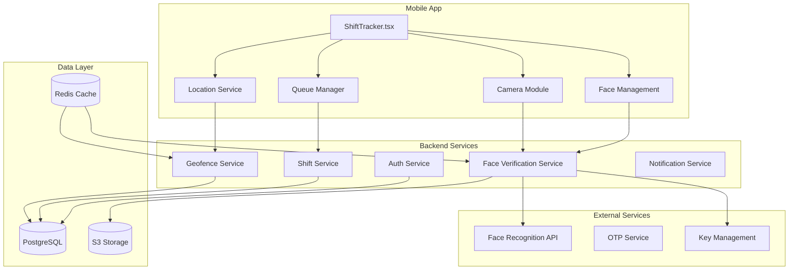

# Shift Start/End Face + Geofence Verification - Design Document

## Design Overview

This document outlines the technical design for implementing face verification and embedded mapping in the ShiftTracker component. The design addresses requirements FR-001 through FR-005 and provides a comprehensive architecture for secure, performant biometric verification.

## Requirement Mapping

| Design Section | Requirements Addressed |
|----------------|------------------------|
| Architecture Overview | FR-001, FR-002, FR-003, FR-004, FR-005 |
| Data Model Changes | FR-002, FR-003, FR-004 |
| API Contracts | FR-002, FR-003, FR-004 |
| Client Implementation | FR-001, FR-002, FR-003, FR-004 |
| Security & Privacy | FR-002, FR-003, FR-004, FR-005 |
| Performance & Testing | FR-001, FR-002, FR-003, FR-004, FR-005 |

## High-Level Architecture



## Data Model Changes

### Database Schema Updates

#### Users Table
```sql
-- Add face verification fields to users table
ALTER TABLE users ADD COLUMN IF NOT EXISTS face_registered BOOLEAN DEFAULT FALSE;
ALTER TABLE users ADD COLUMN IF NOT EXISTS face_template_hash VARCHAR(255);
ALTER TABLE users ADD COLUMN IF NOT EXISTS face_image_url VARCHAR(500);
ALTER TABLE users ADD COLUMN IF NOT EXISTS face_registered_at TIMESTAMP;
ALTER TABLE users ADD COLUMN IF NOT EXISTS face_otp_enabled BOOLEAN DEFAULT TRUE;
ALTER TABLE users ADD COLUMN IF NOT EXISTS face_consent_given_at TIMESTAMP;
ALTER TABLE users ADD COLUMN IF NOT EXISTS face_consent_withdrawn_at TIMESTAMP;

-- Indexes
CREATE INDEX IF NOT EXISTS idx_users_face_registered ON users(face_registered);
CREATE INDEX IF NOT EXISTS idx_users_face_template_hash ON users(face_template_hash);
```

#### employee_shifts Table
```sql
-- Add face verification fields to employee_shifts table
ALTER TABLE employee_shifts ADD COLUMN IF NOT EXISTS face_verified BOOLEAN DEFAULT FALSE;
ALTER TABLE employee_shifts ADD COLUMN IF NOT EXISTS face_verification_time TIMESTAMP;
ALTER TABLE employee_shifts ADD COLUMN IF NOT EXISTS face_verification_method VARCHAR(50);
ALTER TABLE employee_shifts ADD COLUMN IF NOT EXISTS face_verification_hash VARCHAR(255);
ALTER TABLE employee_shifts ADD COLUMN IF NOT EXISTS face_verification_score DECIMAL(3,2);

-- Indexes
CREATE INDEX IF NOT EXISTS idx_emp_shifts_face_verified ON employee_shifts(face_verified);
CREATE INDEX IF NOT EXISTS idx_emp_shifts_face_verification_time ON employee_shifts(face_verification_time);
```

> Note: We will NOT create any new audit tables. Failures and anomalies will be recorded via the existing `error_logs` table with `service = 'face_verification'` and contextual metadata.

### TypeScript Interfaces

```typescript
// Core face verification interfaces
interface UserFace {
  id: string;
  userId: number;
  faceRegistered: boolean;
  faceTemplateHash: string | null;
  faceImageUrl: string | null;
  faceRegisteredAt: Date | null;
  faceOtpEnabled: boolean;
  faceConsentGivenAt: Date | null;
  faceConsentWithdrawnAt: Date | null;
}

interface FaceVerificationRequest {
  userId: number;
  imageBase64: string;
  timestamp: string;
  location: {
    latitude: number;
    longitude: number;
    accuracy: number;
  };
  deviceFingerprint: string;
  shiftId?: number;
}

interface FaceVerificationResponse {
  success: boolean;
  match: boolean;
  score: number;
  // No auditId — we store outcome directly on employee_shifts
  errorMessage?: string;
  requiresManagerOverride?: boolean;
}

interface GeofenceInfo {
  id: string;
  name: string;
  latitude: number;
  longitude: number;
  radius: number;
  isInside: boolean;
  distance?: number;
}
```

## API Contracts

### Face Registration Endpoint

```typescript
// POST /api/users/photo/register
interface RegisterFaceRequest {
  userId: number;
  images: string[]; // Base64 encoded, max 5 images
  consent: boolean;
  deviceFingerprint: string;
  location?: { latitude: number; longitude: number; accuracy: number };
}

interface RegisterFaceResponse {
  success: boolean;
  faceTemplateHash: string;
  imageUrl: string;
  message: string;
  errorCode?: string;
}

// Status: 200, 400, 401, 403, 413, 500
```

### Face Verification Endpoint

```typescript
// POST /api/users/photo/verify
interface VerifyFaceRequest {
  userId: number;
  imageBase64: string;
  timestamp: string;
  location: { latitude: number; longitude: number; accuracy: number };
  deviceFingerprint: string;
  shiftId?: number;
  verificationType: 'shift_start' | 'shift_end';
}

interface VerifyFaceResponse {
  success: boolean;
  match: boolean;
  score: number;
  requiresManagerOverride: boolean;
  errorMessage?: string;
  errorCode?: string;
}

// Response Status Codes
// 200: Success
// 400: Invalid request
// 401: Unauthorized
// 403: Face not registered
// 429: Rate limit exceeded
// 500: Internal server error
```

### Geofence Nearby Endpoint

```typescript
// GET /api/geofences/nearby?lat={latitude}&lng={longitude}&radius={meters}
interface GeofenceNearbyResponse {
  success: boolean;
  geofences: GeofenceInfo[];
  userLocation: { latitude: number; longitude: number; accuracy: number };
  errorMessage?: string;
}
```

### Face Configuration OTP Endpoints

```typescript
// POST /api/settings/face-config/otp/request
interface RequestOtpRequest { userId: number; actionType: 'add_face' | 'remove_face'; contactMethod: 'email' | 'phone'; }
interface RequestOtpResponse { success: boolean; message: string; expiresIn: number; errorMessage?: string; }

// POST /api/settings/face-config/otp/verify
interface VerifyOtpRequest { userId: number; otpCode: string; actionType: 'add_face' | 'remove_face'; }
interface VerifyOtpResponse { success: boolean; message: string; sessionToken: string; errorMessage?: string; }
```

## Client Implementation

### ShiftTracker.tsx Integration (excerpt)

```typescript
// On success, write verification outcome to employee_shifts via shift start/end endpoints
await axios.post(`${API}/api/shifts/start`, {
  startTime: formatDateForBackend(new Date()),
  location: getCurrentLocationData(),
  faceVerification: {
    match: verificationResult.match,
    score: verificationResult.score,
    method: 'face',
    // server will derive and persist hash/time
  }
});
```

## Sequence Diagram

```mermaid
sequenceDiagram
    participant U as User
    participant ST as ShiftTracker
    participant CL as Camera/Liveness
    participant FV as Face Verification
    participant SS as Shift Service
    participant DB as PostgreSQL

    U->>ST: Tap "Start Shift"
    ST->>ST: Validate location & geofence
    ST->>CL: Start liveness detection
    CL->>CL: Auto-capture on blink
    CL->>ST: Return captured image
    ST->>FV: POST /api/users/photo/verify
    FV->>ST: { match, score }
    alt match == true
        ST->>SS: POST /api/shifts/start { faceVerification }
        SS->>DB: UPDATE employee_shifts SET face_* fields
        SS-->>ST: 200 OK
    else match == false
        ST->>ST: Show retry / manager override
        ST->>DB: (optional) no write; failures logged to error_logs by backend
    end
```

## Security & Privacy Implementation

- Encrypt templates (PBKDF2/Argon2), AES-256 at rest
- TLS 1.3 in transit; certificate pinning on mobile
- Rate limit verification endpoint; lockout on abuse
- Use `error_logs` for failures/anomalies (no new audit tables)
- Never persist raw images beyond necessary processing window

## Testing Strategy (abridged)

- Unit: template hashing, matching thresholds, OTP, rate-limits
- Integration: `/users/photo/register`, `/users/photo/verify`, `/geofences/nearby`, shift start/end writes to `employee_shifts`
- E2E: start/end shift with success/failure, offline queueing, OTP add/remove, multiple faces, geofence name display

## Deployment & Migration

```sql
BEGIN;
-- users additions (as above)
-- employee_shifts additions (as above)
COMMIT;
```

Rollback: drop new columns only if empty or after data export confirmation.

---

## Notes for Reviewers

- Aligned to existing tables: `users`, `employee_shifts`, `company_geofences`, `employee_locations`, `error_logs`
- No new audit tables introduced
- Verification outcomes persisted on `employee_shifts`
- Failures recorded via `error_logs` with metadata
